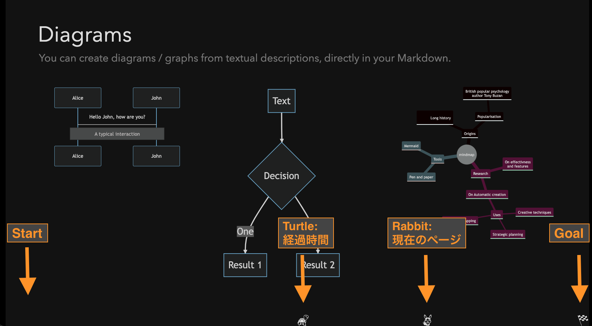

# slidev-rabbit-turtle

Presentation time management for slidev inspired by [rabbit\-shocker/rabbit](https://github.com/rabbit-shocker/rabbit/) | [Rabbit \- はじめに](https://rabbit-shocker.org/ja/)

# Demo

https://kaakaa.github.io/slidev-rabbit-turtle/1?time=1

## Description

# License

This repository distributes under [MIT License](./LICENSE)

Icons used in this slide are distributed from [Emoji One \(Monotone\)](https://icon-sets.iconify.design/emojione-monotone/) under [CC BY 4.0](https://creativecommons.org/licenses/by/4.0/deed.ja).

